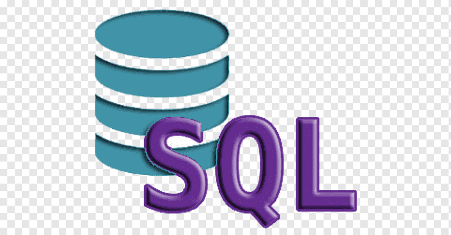

##      :computer:	Módulo I - Conteúdo de abertura :computer:

 

#### • Criando meu primeiro repositório no GitHub para compartilhar meu progresso!! 

​		Durante o primeiro módulo do bootcamp, TQI - Fullstack Developer, foi requisitado como projeto o primeiro repositório no github. Para isso, irei utilizar como meu primeiro repositório os conhecimentos que foram passado durante meu terceiro período de faculdade em ADS, dentro do conteúdo "Modelagem e Desenvolvimento em Banco de Dados". 

​		Conteúdo versado pelo professor Walisson Alves Pereira. 

 

## :books: Tópicos apresentados durante meu curso!

> #####  **Conteúdo que foi passado durante a primeira etapa:**

• Criação de uma tabela e utilização de "select";

• Atividade para criação de um banco de dados para registro dos livros de uma biblioteca. Após isso, consultar esses dados!

• Atividade: criação de um banco de dados chamado "Empresa" e após isso inserir os dados que foram disponibilizados pelo professor dentro de sala de aula e, com isso, fazer a atividade de query;

• INNER JOIN = durante esse conteúdo foi criado um banco de dados "Comercio" com as seguintes tabelas: Cliente, Endereço e telefone.  Durante esse conteúdo foi apresentado as definições de projeção, origem e seleção;

• Utilizando-se o banco "Comércio", iremos utilizar os seguintes "comandos": UPDATE, DELITE, ALTER TABLE (MODIFY, CHANGE, ADD, DROP);

• Criação de view;

• Funções de agregação numérica.

> ##### **Conteúdo que foi passado durante a segunda etapa:**

• Procedures;

• Trigger;

• Atividade para recapitular, ou seja, para praticar os conteúdos sobre procedures e trigger em questão!

